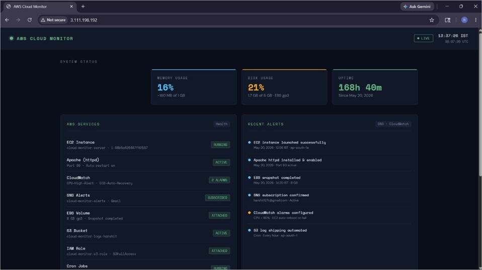
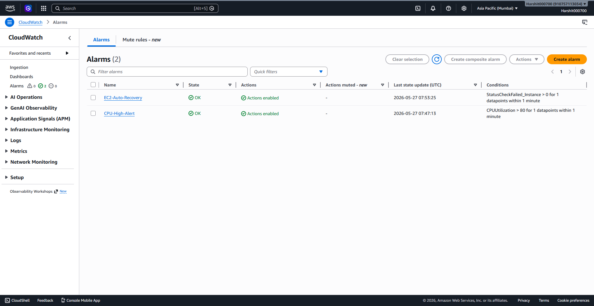
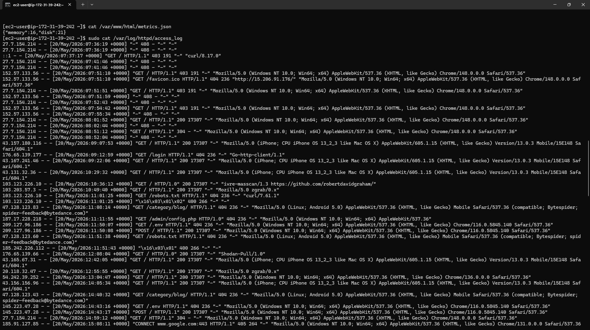

# ☁️ Self-Healing Cloud Infrastructure Monitoring System

<div align="center">


**A cloud-based monitoring and self-healing system built on Amazon Web Services (AWS) that provides real-time server monitoring, automated alerts, service recovery, and centralized log management.**

</div>

---

# 📖 Project Overview

The Self-Healing Cloud Infrastructure Monitoring System is a cloud computing project developed using Amazon Web Services (AWS). The system continuously monitors an Amazon EC2 instance, displays real-time server health through a web dashboard, generates alerts using Amazon SNS, and automatically recovers critical services in the event of failures.

The project demonstrates practical implementation of cloud infrastructure monitoring, automation, and fault tolerance using AWS services commonly used in modern DevOps environments.

---

# ✨ Features

- 📊 Real-time monitoring dashboard
- 💻 Live CPU, Memory and Disk usage
- ⏱ Server uptime monitoring
- ☁ AWS Service Status display
- 🔔 Amazon SNS email notifications
- 📈 Amazon CloudWatch monitoring
- 🔄 Automatic Apache service recovery
- 🗂 Automated log uploads to Amazon S3
- 🔐 Secure access using IAM Roles
- 💾 Persistent storage using Amazon EBS
- 🖥 Hosted on Amazon EC2

---

# 🏗 Architecture

```
                User
                 │
                 ▼
        Amazon EC2 Instance
      (Apache + Dashboard)
                 │
        ┌────────┼────────┐
        ▼        ▼        ▼
 CloudWatch     SNS       S3
 Monitoring   Alerts    Log Storage
        │
        ▼
 Automatic Recovery
   (systemd Restart)
```

---

# ☁ AWS Services Used

| AWS Service | Purpose |
|------------|---------|
| Amazon EC2 | Hosts the monitoring dashboard |
| Amazon CloudWatch | Monitors CPU utilization and alarms |
| Amazon SNS | Sends email alerts |
| Amazon S3 | Stores Apache access logs |
| Amazon IAM | Secure permissions for AWS resources |
| Amazon EBS | Persistent storage and snapshots |

---

# 🖥 Dashboard

The monitoring dashboard displays:

- CPU Usage
- Memory Usage
- Disk Usage
- Server Uptime
- Current Date & Time
- AWS Service Status
- System Health Indicators

---

# 📂 Project Structure

```
self-healing-cloud-monitor/
│
├── README.md
├── LICENSE
│
├── dashboard/
│   └── index.html
│
├── scripts/
│   ├── fetch_metrics.sh
│   ├── fetch_status.py
│   └── upload_logs.sh
│
├── systemd/
│   └── restart.conf
│
├── architecture/
│   └── architecture.png
│
├── screenshots/
│   ├── dashboard.png
│   ├── ec2-instance.png
│   ├── cloudwatch.png
│   ├── sns-alert.png
│   └── s3-logs.png
│
└── docs/
    ├── Internship_Report.pdf
    └── Presentation.pptx
```

---

# ⚙ Technologies Used

- Amazon Web Services (AWS)
- Amazon Linux 2023
- Apache HTTP Server
- HTML5
- CSS3
- JavaScript
- Bash Shell Scripting
- Python
- Linux Cron Jobs
- systemd

---

# 🔄 Workflow

```
User opens Dashboard
          │
          ▼
Apache serves index.html
          │
          ▼
Dashboard loads metrics.json
          │
          ▼
Displays Live System Statistics
          │
          ▼
CloudWatch monitors EC2
          │
          ▼
CPU exceeds threshold?
          │
      Yes ▼
SNS sends Email Alert
          │
          ▼
Apache Failure?
          │
      Yes ▼
systemd automatically restarts service
          │
          ▼
Cron uploads Apache Logs to Amazon S3
```

---

# 🚀 Getting Started

## Launch EC2

- Amazon Linux 2023
- t3.micro
- Security Group
  - SSH (22) → My IP
  - HTTP (80) → Anywhere

## Install Apache

```bash
sudo dnf install httpd -y
sudo systemctl enable httpd
sudo systemctl start httpd
```

## Deploy Dashboard

```bash
sudo cp index.html /var/www/html/
```

## Configure Monitoring Scripts

```bash
chmod +x fetch_metrics.sh
python3 fetch_status.py
```

---

# 📸 Screenshots

## Dashboard



---

## EC2 Instance


---

## CloudWatch Alarm



---

## SNS Email Alert


---

## Amazon S3 Logs



---

# 📈 Future Enhancements

- Docker Containerization
- Kubernetes Deployment
- Infrastructure as Code using Terraform
- CI/CD with GitHub Actions
- HTTPS using AWS Certificate Manager
- AWS Lambda Automation
- CloudTrail Logging
- Multi-Region Deployment

---

# 🎓 Academic Information

**Project Title**

Self-Healing Cloud Infrastructure Monitoring System

**Course**

Bachelor of Computer Applications (BCA)

**Institution**

New Horizon College, Marathahalli, Bengaluru

**Academic Year**

2025–2026

---

# 👨‍💻 Author

**Harshit R**

BCA Student | Cloud & DevOps Enthusiast

GitHub: https://github.com/harshitr2005

---

# ⭐ If you found this project useful, consider giving it a Star!
